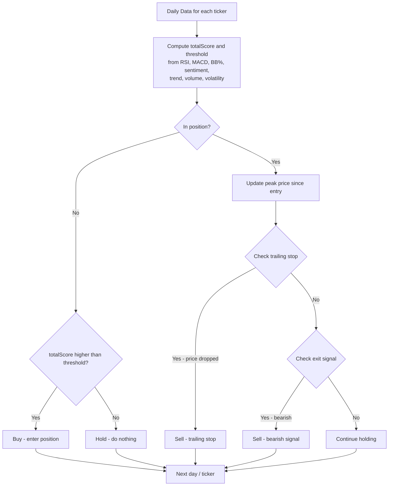

# Team 11 - Crypto Trading Strategy

## Team Members
- Alrida Lana - `lanaalrida`
- Evseev Nikita - `evslou`
- Chekmaeva Sofya - `SofyaChekmaeva`

## Strategy Overview

### LLM Metrics Design
**Extracted Metrics:**
- `sentiment_score`: captures the overall tone of news articles (positive/negative) over the 3‑month period. News sentiment is a **leading indicator of price movements**, as positive coverage often attracts buyers and negative coverage triggers selling;
- `regulatory_risk`: quantifies the level of regulatory uncertainty or adverse legal actions mentioned. In crypto, regulations can make or break a project; high risk may deter institutional investment and suppress prices;
- `adoption_signal`: measures the strength of partnerships, integrations, institutional involvement, or real‑world use cases. Adoption signals long‑term value and growing demand, which supports price appreciation;
- `whale_activity`: indicates whether large holders (whales) are accumulating or distributing based on news of large transactions or exchange flows. Whale behavior often precedes major price moves;
- `key_events`: identifies specific catalysts (e.g., ETF approval, hack, protocol upgrade) that explain price volatility and provide context for the other metrics.
- `market_mood`: a qualitative summary that combines news and technical trends (e.g., RSI, MACD) to give a holistic view of whether the market feels bullish, bearish, or neutral over the period;
- `confidence`: reflects the analyst’s certainty in the recommendation, allowing the algorithm to weigh the signal appropriately and avoid acting on low‑confidence insights.
- `recommended_action`: the **final trading decision** (“buy”, “sell”, “hold”) derived from the interplay of all the above metrics, ensuring a single actionable output.

**Design Philosophy:** 

Shift from reactive, single‑day analysis to a strategic, multi‑month framework that **aggregates news and market trends**. By extracting structured signals (sentiment, adoption, regulatory risk, whale activity) and combining them with summarized technicals, the prompt enables a holistic view of momentum and risk. This approach yields a single, actionable trading recommendation grounded in both narrative and data, suitable for swing or position trading decisions.

### Business Logic Design

**Core Decision Rules:**
- Buy:

  Condition: `sentiment > 0.5` AND `RSI < 70` AND `Bollinger Band Position < 0.8`
  Interpretation: Strong positive sentiment, not overbought, and price not near the upper resistance band

- Sell:

  Condition: `sentiment < -0.3` OR `RSI > 75`
  Interpretation: Either negative sentiment or overbought conditions trigger a sell signal

- Emergency Sell:

  Condition: `RSI > 85`
  Interpretation: Extreme overbought condition acts as a stop‑loss override (though note that this is already covered by RSI > 75, so it's redundant in practice).

- Hold
- 
  Default when no buy or sell condition is met.

**Mermaid diagram:**

## Performance Analysis:

| Metrics  | Value |
| ------------- | ------------- |
| Total Trades  | 8  |
| Win Rate  | 87.5%  |
| Profit Factor  | 9.13  |
| Total Return  | 2.19%  |
| Sharpe Ratio  | 2.90  |
| Max Drawdown  | -1.30%  |
| Final Balance  | $10 218.70  |
